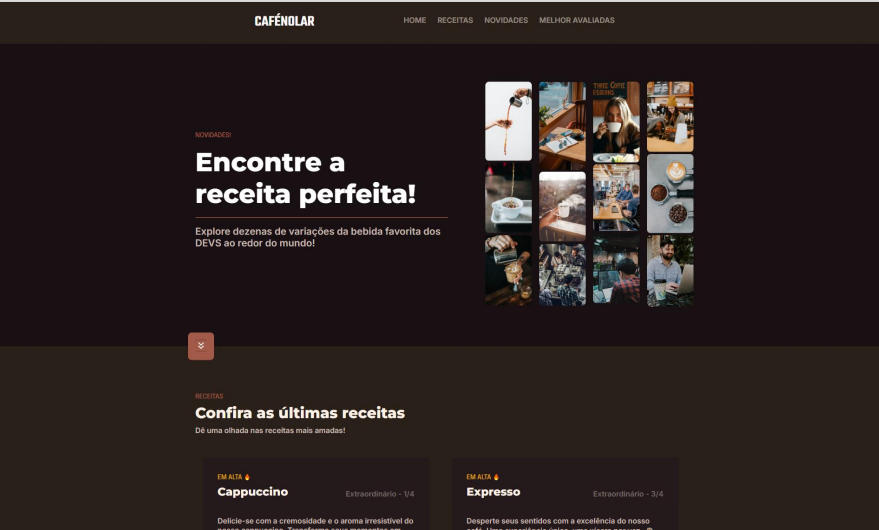

# 📝 Página web de Receitas de Café  com efeito em JS☕

> Esse projeto foi desenvolvido em HTML + CSS, deixando com reponsividade e com efeito no banner através de JS.

### Ajustes e melhorias

O projeto ainda está em desenvolvimento e as próximas atualizações serão voltadas nas seguintes tarefas:

- [x] Tarefa 1: desenvolver a identidade visual da empresa
- [x] Tarefa 2: realizar a estrutura em html
- [x] Tarefa 3: realizar a estilização em CSS
- [x] Tarefa 4: realizar o ajuste para responsividade
- [x] Tarefa 5: efeito no banner com JS
- [ ] Tarefa 6: desenvolver a página de produtos

## 💻 Tecnologias utilizadas

As tecnologias utilizadas para o desenvolvimento desse projeto foram:

* Linguagem de Marcação `html`
* Folha de estilo `CSS`
* Programação `JavaScript` 

## Preview

